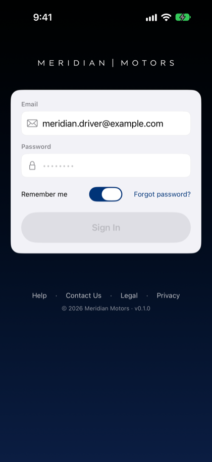
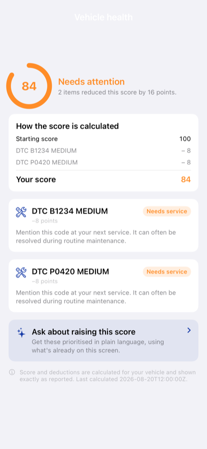

# Meridian Motors Companion — iOS driver app

A native SwiftUI iOS application: the driver-facing surface of the Connected Mobility (CMS)
platform and its companion Agentic Vehicle Experience (AVX) accelerator. Where the Fleet Manager
console shows an operator every vehicle in a fleet, this app shows one driver the one vehicle
assigned to them — plus voice assistance, alerts, service booking, and the vehicle-acquisition
journey.

> **Status: demonstration application.** Functional against a deployed staging environment. Voice
> and the agentic surfaces require the
> [Agentic Vehicle Experience](https://github.com/aws-solutions-library-samples/guidance-for-connected-vehicle-experience-on-aws)
> backend; the vehicle-claim, remote-command and live-telemetry surfaces require CMS.

| | |
|---|---|
|  |  |
| Sign-in. The email is pre-filled from build configuration in debug builds. The password field is empty — its placeholder renders as dots — so *Sign In* is disabled until a password is present. Set `VSA_DEMO_PASSWORD` in your untracked local config to pre-fill it. | Vehicle health. The score, its deductions, and the "last calculated" footer are rendered exactly as reported — the app does not recompute them. |

## Features

- **Voice assistant** — hands-free interaction over Amazon Bedrock AgentCore with Amazon Nova 2
  Sonic bidirectional speech, including a reasoning drawer that shows which tools the agent called
  and what they returned
- **Vehicle** — live telemetry over a WebSocket, vehicle state, trip history, and health detail
- **Alerts** — diagnostic trouble codes, safety events, triage outcomes, and agent Findings for the
  signed-in driver's own vehicle
- **Remote controls** — door locks, remote start, preconditioning, hazards, vehicle locator, charge
  door and panic mode, rendered from the platform's command catalog rather than hardcoded
- **Service** — service history and appointment booking, with a *Book Service* action that opens the
  assistant on a primed prompt
- **Buy** — the Acquire journey: discovery, configurator, upgrade offers, lead capture and order
  tracking (shown only for tenant segments that enable it)
- **Biometric auth** — Face ID / Touch ID unlocking an Amazon Cognito session held in the keychain
- **Tenant theming** — colors, logos and tab labels derived from a tenant configuration row

For the application's architecture — the voice session state machine and wire protocol, the Finding
and Action contracts, the configurator step sequence, and the reasoning behind each — see the **The
Companion App** chapter of the AVX implementation guide.

## Prerequisites

- macOS with Xcode 16+
- iOS 18.0+ simulator or device
- A deployed backend. Either accelerator alone yields a working but partial app — an unset endpoint
  hides its affordance rather than breaking the app:
  1. [Connected Mobility (CMS)](../../README.md) — vehicle registry, remote commands, live telemetry
  2. [Agentic Vehicle Experience (AVX)](https://github.com/aws-solutions-library-samples/guidance-for-connected-vehicle-experience-on-aws) — the agent runtimes, REST API, Findings and journey surfaces

No external package dependencies — the app uses only Apple frameworks (SwiftUI, AVFoundation,
LocalAuthentication, CryptoKit), so a clone builds without a package resolution step.

## Configuration

All backend connection details are injected at build time via `.xcconfig` files under
`MeridianMotorsCompanion/Config/`. `VSAConfig.swift` reads them through `Info.plist` substitution —
you never edit Swift source to point the app at your deployment.

Two layers:

- **Tracked, ship-safe placeholders** — `Staging.xcconfig` (Debug scheme) and `Release.xcconfig`
  (Release scheme). These contain fail-loud placeholder tokens such as
  `<REPLACE_WITH_USER_POOL_ID>`. Do **not** commit real values here.
- **Untracked, per-developer real values** — `Staging.local.xcconfig` and `Release.local.xcconfig`,
  both gitignored. Each tracked xcconfig ends with `#include? "…local.xcconfig"`, so a `.local`
  sibling overrides the placeholders at build time when present. Absent, the build still succeeds
  (`#include?` is the optional variant) but the app raises a diagnostic `assertionFailure` at
  startup in Debug rather than passing placeholders to Amazon Cognito.

### First-time setup (per clone)

1. Copy the template:

   ```bash
   cp clients/ios/MeridianMotorsCompanion/Config/Staging.local.xcconfig.example \
      clients/ios/MeridianMotorsCompanion/Config/Staging.local.xcconfig
   ```

   (Same for `Release.local.xcconfig.example` if you build a Release scheme.)

2. Fill in your deployment values — see the table below.

3. In Xcode: **Product → Clean Build Folder** (⇧⌘K), then build and run. The clean is required so
   xcconfig substitution re-runs.

   If you use the prebuilt-zip flow (`scripts/build_ios_simulator_app.sh`), the local xcconfig
   values are baked into the produced `.app.zip` at build time — rebuild whenever you change them.

### Where each value comes from

| xcconfig key | Source |
|--------------|--------|
| `VSA_AWS_REGION` | Your deployment Region |
| `VSA_REST_API_URL` | AVX `vsa-<stage>-api` stack output `RestApiUrl` |
| `VSA_WS_API_URL` | AVX `vsa-<stage>-api` stack output `WsApiUrl` |
| `VSA_AGENTCORE_RUNTIME_ARN` | The AVX bidirectional runtime ARN (`.bedrock_agentcore.yaml`, block `vsa_supervisor_bidi_<stage>`) |
| `VSA_CMS_REST_API_URL` | CMS `cms-<stage>-ui-api` output — leave empty to hide the claim-vehicle affordance |
| `VSA_COMMANDS_API_URL` | CMS `cms-<stage>-commands-api` output — leave empty to hide remote controls |
| `VSA_TELEMETRY_WS_URL` | CMS `cms-<stage>-ws-fanout` output |
| `VSA_USER_POOL_ID` | The CMS UI Amazon Cognito pool — the same one the CMS web UI signs into |
| `VSA_USER_POOL_CLIENT_ID` | The iOS-facing app client on that pool |
| `VSA_IDENTITY_POOL_ID` | An identity pool federated with that user pool, used to obtain SigV4 credentials for AgentCore |
| `VSA_CONNECT_REGION` | Region of the Amazon Connect instance used for contact-center escalation |
| `VSA_VEHICLE_360_BASE_URL`, `VSA_VEHICLE_360_FRAMES` | Optional. Source and frame count for the 360° vehicle sweep; leave the count at `0` to disable |
| `VSA_DEMO_PASSWORD` | **Debug builds only.** Pre-fills the sign-in password for a demo persona. Empty in tracked config; supply it only in your untracked `.local.xcconfig`. Release builds ignore this key. |

### Getting stack outputs

```bash
aws cloudformation describe-stacks \
  --stack-name vsa-<stage>-api \
  --query 'Stacks[0].Outputs' \
  --output table
```

## Build and run

```bash
open clients/ios/MeridianMotorsCompanion.xcodeproj
```

Select a simulator or device, then build (⌘B) and run (⌘R).

For a signing-free simulator build as a distributable zip — useful for anyone demonstrating the app
who does not need the Xcode toolchain:

```bash
clients/ios/scripts/build_ios_simulator_app.sh      # produces build/…app.zip
clients/ios/scripts/install_ios_sim_demo_app.sh     # installs it on a booted simulator
```

## How it connects

The app is a client of **both** accelerators. Most vehicle data arrives through the AVX API, which
aggregates it from the CMS data layer and applies the caller's scope; three CMS surfaces are called
**directly**, because each needs a path the aggregation layer does not provide.

```
                       ┌──────────────────────────────┐
      Cognito JWT      │  AVX REST API                │
   ┌────────────────── │  driver + vehicle context,   │
   │                   │  trips, safety events,       │
   │                   │  triage, Findings, booking,  │──┐
   │                   │  service centers, Acquire    │  │  reads
   │                   └──────────────────────────────┘  │
   │                                                     ▼
┌──┴──────────┐                                  ┌──────────────────┐
│  iOS app    │        SigV4 WebSocket           │  CMS data layer  │
│             │ ──────────────────────────────►  │  (DynamoDB +     │
│  VSAClient  │  AgentCore bidirectional runtime │   Redis)         │
│  VSABidi    │  (Nova 2 Sonic voice)            └──────────────────┘
│  Client     │                                          ▲
│             │        Cognito JWT, direct               │
│             │ ─────────────────────────────────────────┘
└─────────────┘        • CMS main API — claim the driver's assigned vehicle
                       • CMS commands API — command catalog + remote commands
                       • CMS ws-fanout — live telemetry and alerts
```

Two consequences worth knowing:

- **An AVX outage degrades the app broadly; a CMS commands-API misconfiguration removes exactly one
  affordance.** The failure surfaces are not shared.
- **A send is not a confirmation.** Issuing a remote command returns "accepted for publication", not
  "performed". The app shows the command as in-flight and confirms separately from command history
  or from live state arriving over the telemetry WebSocket.

Driver scope is enforced server-side, not by the client: a signed-in driver reads the Findings and
the vehicle belonging to that driver, commands act on that vehicle only, and command history shows
the commands that driver issued rather than every command recorded against the vehicle.

## Demo users

Seed a demo environment with `make bootstrap-demo` in the CMS repo and the AVX seed step (see the
AVX `docs/DEPLOYMENT.md`). That provisions one driver persona with a fully populated vehicle
assignment — a driver id, a vehicle id and a tenant id, all of which are immutable in Amazon Cognito
once created.

The persona's email is pre-filled in Debug builds. Its password is **not** in this repository:
supply it via `VSA_DEMO_PASSWORD` in your untracked `.local.xcconfig`, or sign in normally. Release
builds carry no demo credential at all.

> Adding a second persona is a data change rather than a code change, but it requires creating a new
> Cognito user — `custom:driverId`, `custom:vehicleId` and `custom:tenantId` cannot be added to an
> existing account after creation. The sign-in *email* is mutable, so renaming an existing persona's
> login is safe.

## Troubleshooting

| Symptom | Check |
|---|---|
| Network error on launch | `VSA_REST_API_URL` matches your deployed AVX API stage |
| Sign-in fails | User pool id and client id match the pool the app is pointed at; the error alert states the specific reason |
| Voice will not connect | `VSA_AGENTCORE_RUNTIME_ARN` is set, the runtime is deployed, and the identity pool trusts the user pool the app signs into |
| Voice connects, then the agent goes silent mid-session | A tool exceeded Nova's ~1 second completion window. See the AVX guide's troubleshooting chapter |
| No audio, app otherwise fine | The audio device reported a zero sample rate; the session continues as text by design |
| Empty vehicle data | Seed the fleet (`make bootstrap-demo` in the CMS repo) |
| Remote controls absent | `VSA_COMMANDS_API_URL` is unset — the affordance hides rather than showing a dead button |
| Tab labels or theming look wrong | The tenant configuration row was not found and the layout fell back to a default. Check the startup log for the tenant id it tried |

## Diagnostics

The voice flow is instrumented so a single log capture yields a complete causal timeline.

| Prefix | Subsystem |
|---|---|
| `🎤 VOICE:` | `VoiceSessionViewModel` — state machine, connect/disconnect, sendText, tool results, watchdog |
| `🎤 ATV:` | `AssistantTabView` — task lifecycle, view-model resolution, seed message |
| `🎤 MTV:` | `MainTabView` — assistant presentation and teardown |
| `🎤 BIDI:` | `VSABidiClient` — WebSocket handshake and send paths |
| `🎤 CRED:` | `AwsCredentialProvider` — Cognito identity-pool credential exchange |
| `🏷️ TENANT:` | Tenant configuration load, including fallback warnings |
| `💬 CHAT:` | `ConnectChatClient` — Amazon Connect chat over WebSocket |

Capture from a booted simulator:

```bash
xcrun simctl spawn booted log stream --style syslog 2>/dev/null \
  | grep -E '🎤|💬|🏷️|MeridianMotorsCompanion' \
  | tee /tmp/ios-voice.log
```

> Use `--style syslog`, not a `--predicate` filter. Predicate filters do not capture `NSLog` output
> from an app started via `simctl launch`, so a predicate that returns nothing is a false negative
> rather than evidence of missing instrumentation.

The instrumentation observes fixed rules, verified by security review: token bodies, secret keys and
session tokens are never logged (lengths are); access key identifiers are logged as a short prefix
only; and response bodies are logged on failure only, so a successful credential exchange logs a
body length rather than a body. This is what makes a customer-supplied log safe to read.

## Brand assets

The app icon and wordmark are derived from art-source masters by a script — do not hand-edit the
outputs:

```bash
swift scripts/make-brand-assets.swift
```

The launch screen and splash fallback use the single-line wordmark because the animated reveal is
single-line; a two-line static image would visibly jump at the handoff. The app icon uses the
two-line lockup, because a 16.8:1 wordmark fitted into a square renders at roughly 3pt cap height.
Two guards exist because both failure modes shipped once: the wordmark must be content-cropped
rather than the raw square master, and the stacked lockup is drawn as one unit rather than
reassembled from the single-line master, which flattened the designed hierarchy between the two
words. The script fails loudly if handed the wrong master.

The art-source masters themselves are not distributed with this repository.

## Project layout

```
MeridianMotorsCompanion/
├── Config/          # VSAConfig + xcconfig layers — point the app at your deployment here
├── Api/             # REST clients and wire models (AVX, CMS, Acquire, commands, triage)
├── Auth/            # Cognito sign-in, biometrics, keychain
├── Voice/           # Session state machine, bidi WebSocket client, audio capture and playback
├── Telemetry/       # Vehicle telemetry WebSocket client (+ a mock for offline development)
├── Views/           # Screens by tab; Views/Acquire/ holds the journey, Steps/ the configurator
├── Services/        # Push consent, badging, notification deep-link routing
├── Theming/         # Tenant-driven colors and logos
├── UI/              # Layout context, kiosk-mode session handling
└── Models/          # Domain models
```

`Presenter/` and `DemoClips/` support scripted demonstration rather than production behavior.
