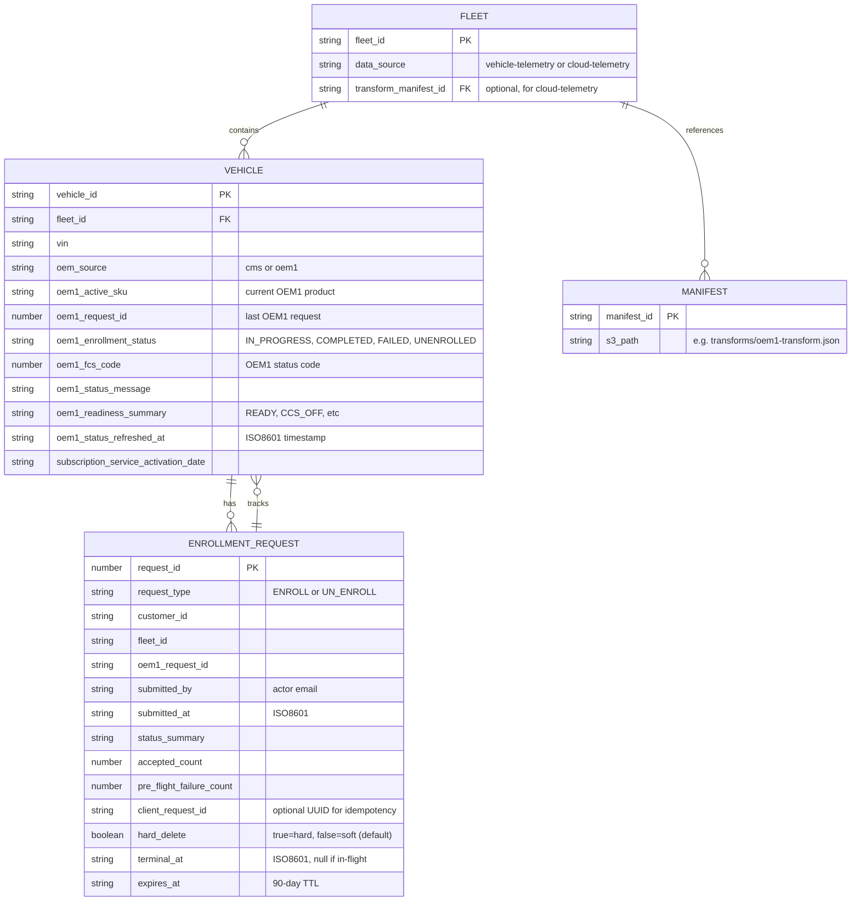
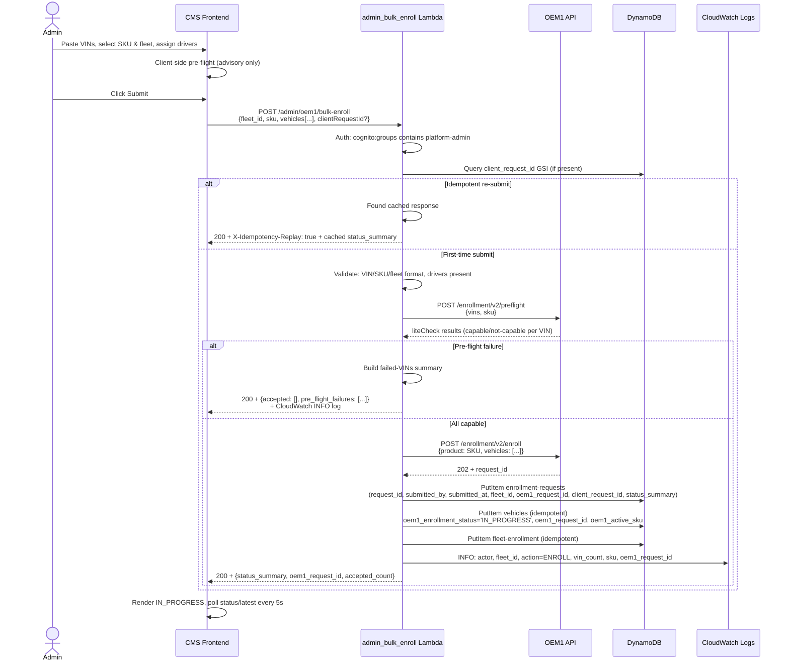
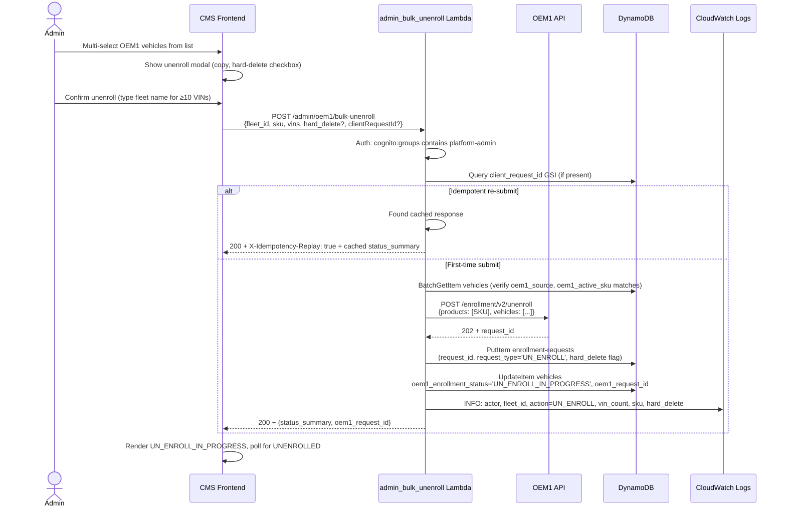
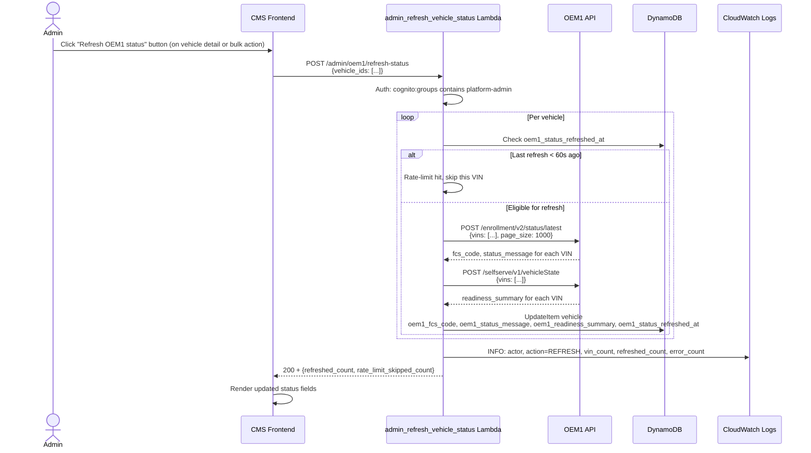
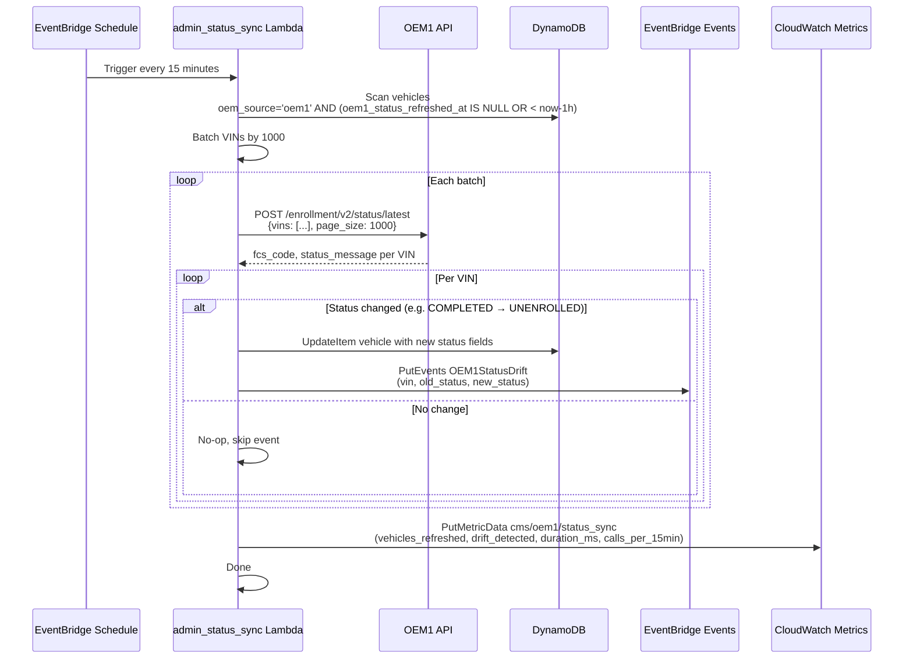

# OEM1 Fleet Lifecycle Architecture

This document describes the data model and operational flows for the OEM1 fleet-scoped bulk lifecycle management system. It covers the enroll, unenroll, refresh-status, and status-sync workflows.

## Data Model

The core entities interact as follows:

**Key design notes:**

- **Fleet source**: `data_source` discriminates between OEM1-sourced fleets (`cloud-telemetry`) and native CMS fleets (`vehicle-telemetry`). Defaults to `vehicle-telemetry` for back-compat.
- **Vehicle inheritance**: All OEM1 vehicles belong to a `cloud-telemetry` fleet; the consistency invariant is enforced at enrollment time.
- **Enrollment-request history**: Every enroll/unenroll submission creates an enrollment-request row, retained for 90 days. The poller consults this table to drive vehicles to terminal states.
- **Status fields**: The 8 new OEM1 status fields (`oem1_*`) are written by multiple Lambdas but only the poller and status-sync drive them to terminal states.

## Enroll Flow

The enroll flow validates a batch of VINs, runs a server-side capability check, submits to OEM1, and persists the request for asynchronous polling.

**Key design points:**

- **Idempotency**: When `clientRequestId` is present and a cached response exists, return immediately without calling OEM1.
- **Pre-flight is mandatory**: Server-side `liteCheck` is always run, regardless of UI state (constraint C3).
- **Async completion**: Returns 200 on OEM1 202; vehicles are marked `IN_PROGRESS` and the poller drives them to terminal.
- **Audit trail**: A CloudWatch structured log line records the submission actor, fleet, VINs, and outcome.

## Unenroll Flow

The unenroll flow submits a batch of VINs for OEM1 unenrollment and marks them pending removal.

**Key design points:**

- **Idempotency**: Same pattern as enroll—cached response on `clientRequestId` re-submit.
- **SKU homogeneity**: All selected vehicles must have the same `oem1_active_sku` (heterogeneous batches rejected 400).
- **Soft vs. hard delete**: Default is soft (mark `Inactive`, clear `oem1_active_sku`); hard-delete is opt-in and does not cascade to trips/events/maintenance-alerts (constraint C9).
- **Poller-driven terminal**: Unenroll requests reach terminal state (UNENROLLED) via the poller's consumption of `status/latest` and application of the Consumer Action policy.

## Refresh-Status Flow

An admin manually refreshes the OEM1 status for a vehicle or batch, subject to a 60-second rate-limit per VIN.

**Key design points:**

- **Per-VIN rate-limit**: 60-second minimum between refreshes for the same VIN (constraint C19).
- **Advisory only**: This is operator-initiated; the background `admin_status_sync` provides continuous sync every 15 minutes.
- **Enrichment**: Fetches both `status/latest` and `vehicleState` to populate both fcs_code and readiness_summary.

## Status-Sync Flow

The system poller runs every 15 minutes (configurable via `cdk.json:context.oem1StatusSyncCadenceMinutes`) to sync OEM1 vehicle status for all OEM1-sourced vehicles not refreshed in the last hour. Drift events are emitted for state transitions.

**Key design points:**

- **Background sync**: Runs independently of user actions; catches OEM1 portal-initiated unenrollments.
- **Drift detection**: Only emits events on terminal-state transitions (e.g. COMPLETED → UNENROLLED), not for IN_PROGRESS → IN_PROGRESS repeats.
- **Rate-limit aware**: Skips vehicles refreshed within the last hour to respect OEM1 API budget (constraint C19).
- **Metrics**: Emits CloudWatch metrics for operational monitoring.

## Consumer Action Policy (Spec § 4.1)

The enrollment poller (`admin_enrollment_poller`) consults the Consumer Action policy table to drive vehicles to terminal states based on OEM1 fcs_codes:

| fcs_code | Name | Behavior |
|---|---|---|
| 0 | Initial request received | Continue polling, backoff schedule per spec § 4.2 |
| 1 | Request processing | Continue polling |
| 2 | Vehicle added to fleet | Continue polling |
| 3 | Successfully enrolled | Terminal COMPLETED; set `subscription_service_activation_date` |
| 5 | Awaiting engine start | Continue polling (related to code 1001) |
| 6 | Vehicle has engine-started | Continue polling |
| 7 | Successfully unenrolled | Terminal UNENROLLED; soft/hard-delete per flag |
| 1001 | Vehicle requires engine start, not keyed-on within 7d | Continue polling, backoff up to 7 days (per OQ4 guidance) |
| 1002 | Vehicle does not meet requirements | Terminal FAILED |
| 1003 | Enrollment limit per fleet reached | Terminal FAILED |
| 8010 | Request ID is invalid | Terminal FAILED |
| 8020 | Enrollment processing timeout (7 days) | Terminal FAILED + emit `OEM1EnrollmentTimeout` event |
| 8030 | VIN not in OEM1 ecosystem | Terminal FAILED (surface immediately, no retry) |
| 8040 | Capability check service unavailable | Terminal FAILED (surface immediately, no retry) |
| 9999 | Please retry the request | Terminal FAILED (surface immediately, no retry; do NOT auto-retry) |
| 429 | OEM1 quota exhausted (HTTP-level) | HTTP 429 passthrough; return upstream; no retry |
| unknown | Unrecognized code | Continue polling with caution; log warning |

**Revision 3 (OQ16) surface-immediately policy**: Codes 9999, 8030, and 8040 are marked for immediate surface on the first poll cycle that returns them. No automatic retry. Manual retry is possible via the UI but only by repeating the user's enroll submission.

## Operational References

- **Postman Collection**: FCS-Vehicle-Enrollment-2.0-postman_collection.json — authoritative for OEM1 endpoint request/response shapes.
- **Spec § 4.1**: Consumer Action policy table (this document, above).
- **Spec § 4.3 (Revision 3)**: OQ16 failure-handling policy — surface-immediately behavior for codes 9999, 8030, 8040.

## See Also

- `docs/DEPLOYMENT.md` — Configuration and operational runbook for this system.
- `docs/runbooks/oem1-fleet-lifecycle.md` — Troubleshooting scenarios and remediation steps.
- Spec: `~/.kiro/specs/2026-06-05-cms-oem1-fleet-bulk-management/spec.md`
